# Coding challenge
This project provides a local REST API and a hosted REST API in Azure. This API was built with FastAPI to access and read CSV files stored in Azure Blob Storage, inserta the data of those CSV files into Azure SQL tables and then compute two metrics.

Features:

* Retrieves data from CSV files in a specified Azure Blob Storage container.
* Exposes an endpoint to fetch data by filename.
* Returns the CSV data structure as JSON (headers and rows).
* Inserts the data into Azure SQL tables.
* Compute two metrics by using the inserted data.
* Inserts the metrics data in its corresponding Azure SQL table.

# Hosted REST API in Azure

The REST API was hosted using service App Services of Azure. To test the hosted API, just use the following link and try the endpoints.

https://fastapi-webapp-southcentralus.azurewebsites.net/docs

Or you can use the direct link to test the endpoints.

The following links are to read the data of the CSV files and to insert that data into the corresponding Azure SQL tables.

https://fastapi-webapp-southcentralus.azurewebsites.net/csv/departments.csv

https://fastapi-webapp-southcentralus.azurewebsites.net/csv/jobs.csv

https://fastapi-webapp-southcentralus.azurewebsites.net/csv/hired_employees.csv

And the following link are to compute the metrics and to insert the metric data into their corresponding Azure SQL tables.

https://fastapi-webapp-southcentralus.azurewebsites.net/hired_by_quarter

https://fastapi-webapp-southcentralus.azurewebsites.net/most_hired_in_2021

# Local REST API

To test the local API, please follow the next steps ahead.

Requirements:

* Python 3.11
* FastAPI
* Azure Storage SDK for Python (azure-storage-blob)
* Pyodbc
* Uvicorn
* Pandas
* SQLAlchemy

Setup:

1. Storage the input .csv input files in your Azure Blob Storage.

* Search Storage accounts on Azure Portal and enter your storage account.

* Then go to Storage browser menu.

* Click on Blob container menu.

* Go to Add container option.

* Open your container and click on Add directory option.

* Go into your directory, click on Upload option to upload the .csv files.

2. Create the server in Azure SQL.

* Search Azure SQL on Azure Portal and click on Create option.

* Select SQL databases and Database server on Resource type to create the server.

* Complete the following fields of resource group, server name, location. Choose the authentication method, for example, the SQL authentication and set an adming login username and a password.

* Then continue with the next configuration (Networking, Security, etc.) or click on Review + create option to finish.

3. Create the database

* On Azure SQL, click on create again.

git
* Select SQL databases and Single database as Resource type and click on Create.

* Complete the basic fields.

* Then continue with the next configurations or click on Review + create to finish.

4. Install required libraries in your virtual environment:

    pip install fastapi azure-storage-blob uvicorn pyodbc pandas sqlalchemy

5. Replace placeholders in main.py:

* YOUR_AZURE_SQL_DATABASE_CONNECTION_STRING_FOR_PYODBC: Your Azure SQL Database connection string  to use with the pyodbc library.
* YOUR_AZURE_SQL_DATABASE_CONNECTION_STRING_FOR_SQLALCHEMY: Your Azure SQL Database connection string to use with the sqlalchemy library.
* YOUR_AZURE_STORAGE_CONNECTION_STRING: Your Azure Storage connection string.
* YOUR_CONTAINER_NAME: The name of the container containing your CSV files.

Running the API:

1. Save the script as main.py.

2. Run the script from the command line:

    python main.py

This starts the FastAPI server on port 8000 by default.

Testing the API:

1. Open the FastAPI documentation in your browser:

    http://localhost:8000/docs

2. Explore the available endpoint (/csv/{filename}) and its usage.

3. Test retrieving specific CSV data by replacing {filename} with the actual file name in the URL (e.g., http://localhost:8000/csv/jobs.csv).

* In the following images, we can see the results of the endpoints. We can find these screenshots on the images folder.

* First, the input CSV files uploaded in the storage account.

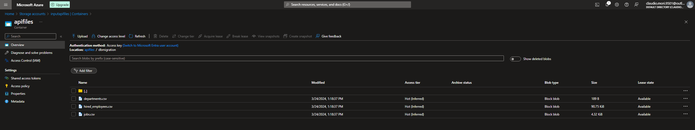

* Then we see the results on Fast API after the CSV data is inserted on the corresponding Azure SQL table.

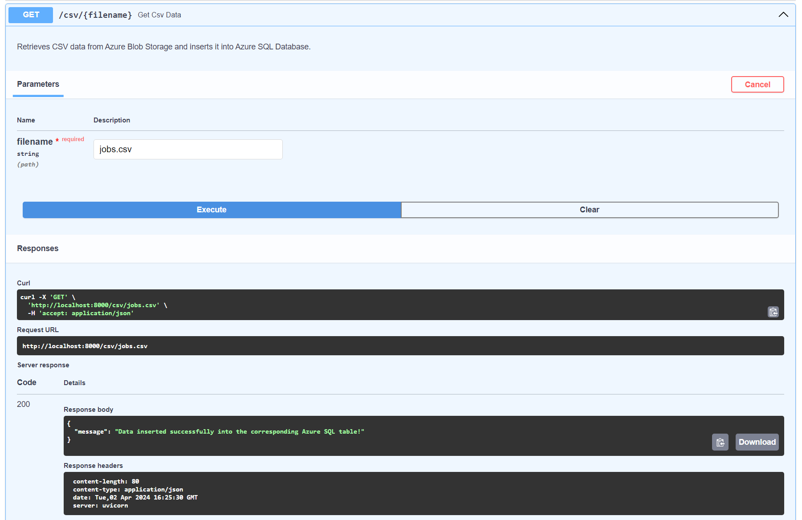

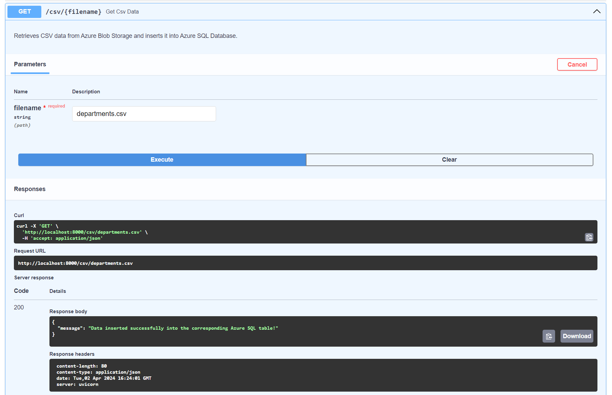

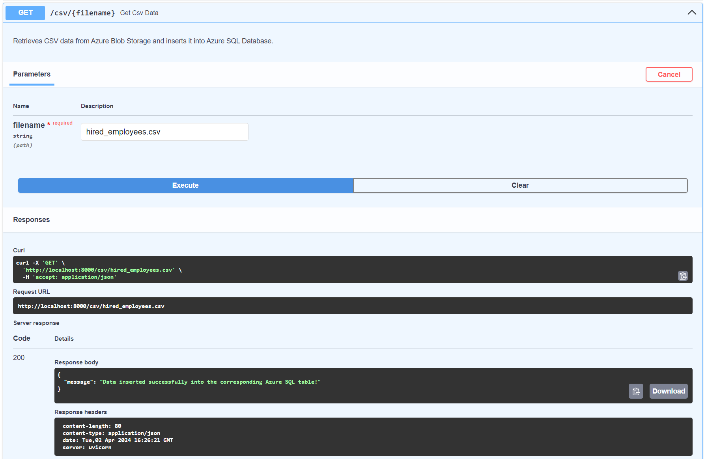

* And the data on the Azure SQL tables

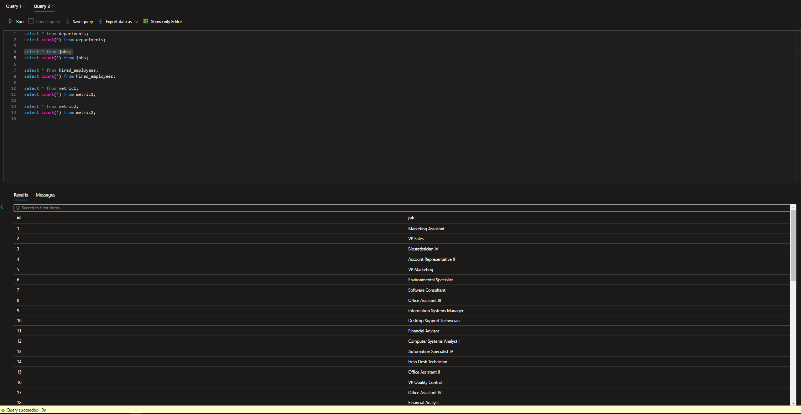

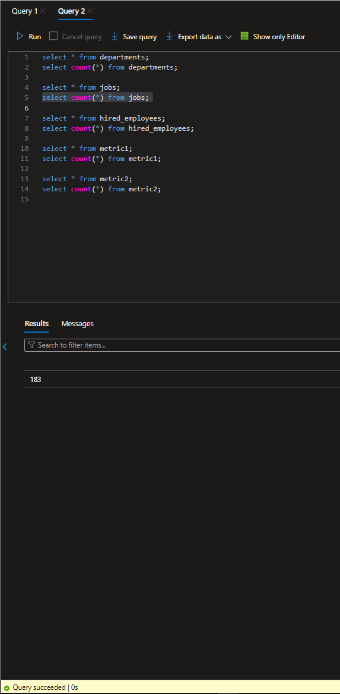

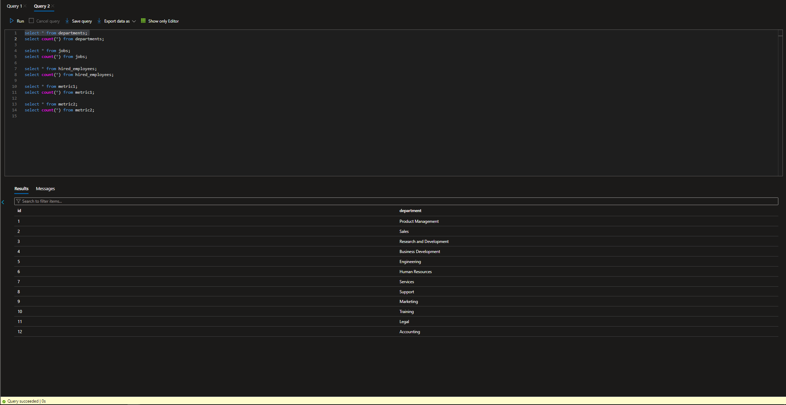

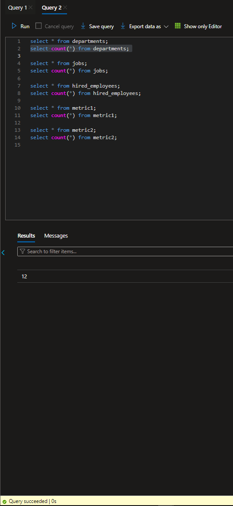

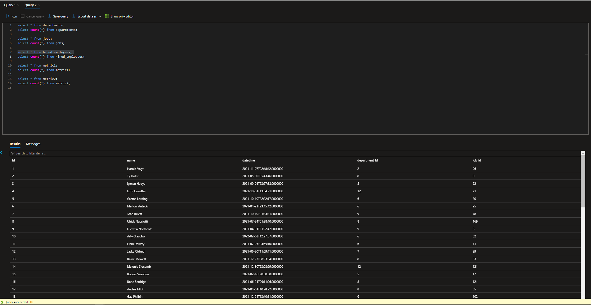

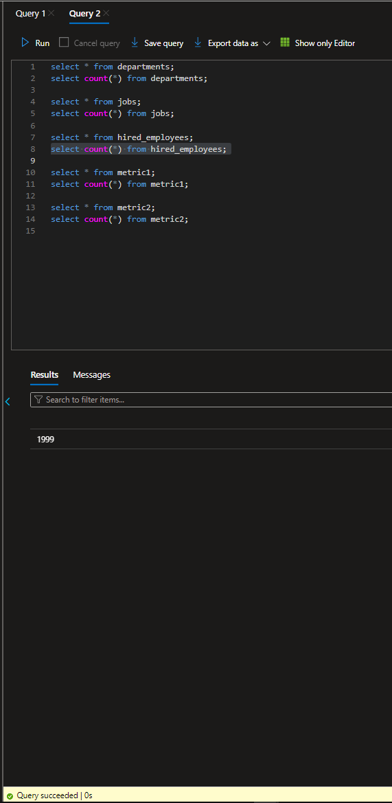

* Here we can see the result on Fast API of the first metric computed about the number of employees hired for each job and department for each quarter in 2021.

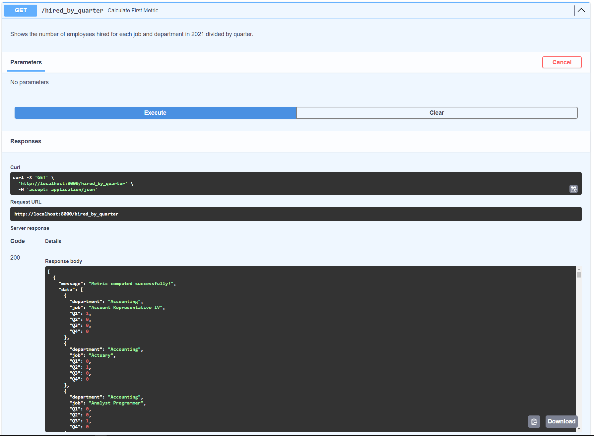

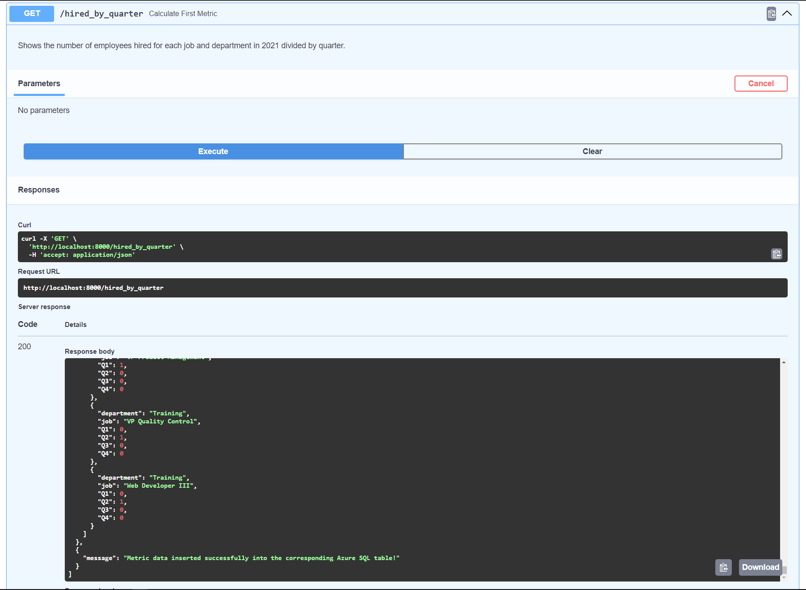

* And also for the second metric of the departments that hired more employees than the mean of employees hired in 2021 of all departments.

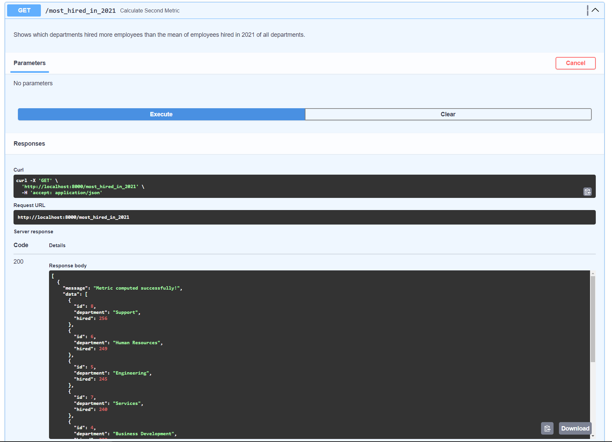

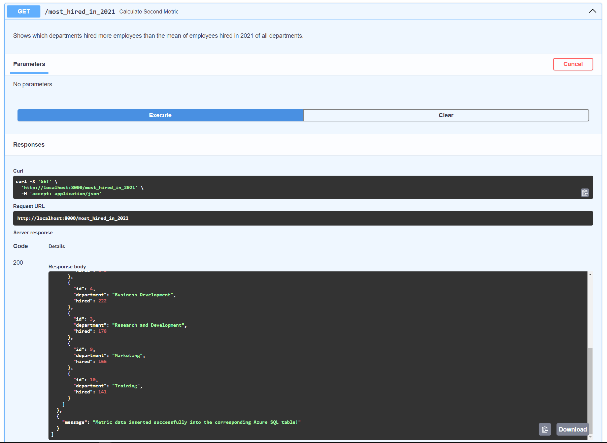

* That data obtained of both metrics were also inserted in Azure SQL tables. In the next pics, appears some data of the first metric.

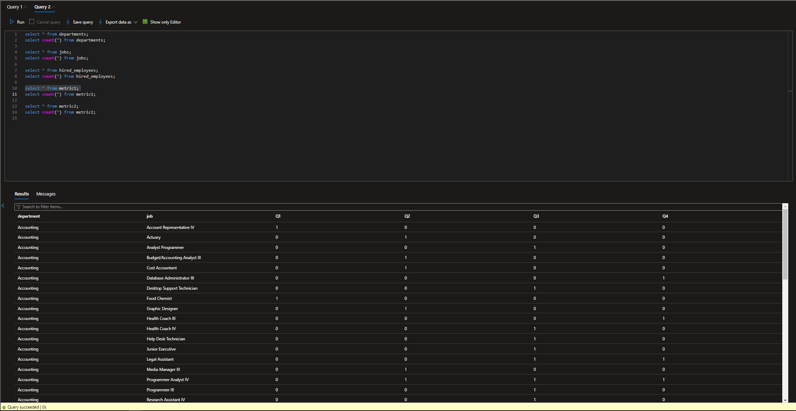

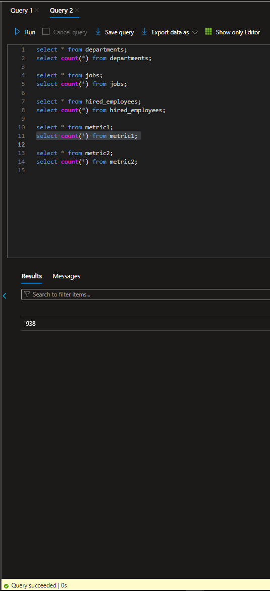

* And also for the second metric.

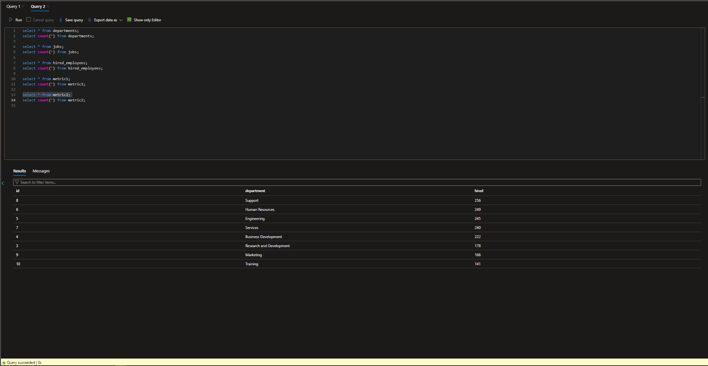

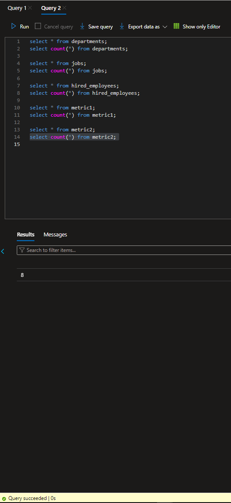
