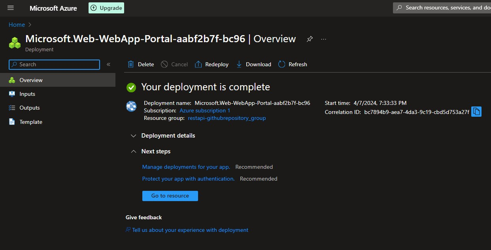

# Coding challenge
This project provides a local REST API and hosted REST APIs in Azure. This API was built with FastAPI to access and read CSV files stored in Azure Blob Storage, insert the data of those CSV files into Azure SQL tables and then compute two metrics. Also, this project provides some visualization of the table where the CSV data is inserted and the metrics.

Features:

* Retrieves data from CSV files in a specified Azure Blob Storage container.
* Exposes an endpoint to fetch data by filename.
* Returns the CSV data structure as JSON (headers and rows).
* Inserts the data into Azure SQL tables.
* Compute two metrics by using the inserted data.
* Inserts the metrics data in its corresponding Azure SQL table.

# Hosted REST API in Azure

## Step to step to deploy the API by using a local folder

First you need to have an Azure subscription, for example, a trial Azure Subscription. Then enter to the [Azure Portal](https://portal.azure.com/) and search for App Services.


The use the Create option and select Web App.


Next we complete the basic information fields, for example, select an existing resource group o choose to create a new one, choose a name for the app service. In this case we use the Code option to publish the API and the runtime stack. Also we select a region and a pricing plan.


Next we go to Monitoring tab and enable the application insights that will alow to see the logs.


Finally, we go to Review + Create tab, wait some seconds and click on Create option.


Then we wait for the app service to be deployed.


A possible issue that may appear can be that the region selected can have a quota of 0 instances. This can be solved by changing the region on the Basics tab.


Now we open Visual Studio Code and install the Azure App Service extension. This will help us later to see app deploying. We can use this extension to create the app service.


Then we go to the Azure left panel option and select to sign in Azure.


After we signed in with our Azure account we will see the name of our subscription.


Next on App Services is going to appear all the app services deployed. We right click on the app service deployed steps before and select Deploy to Web App.


Then we browser the local folder of our coding project we want to deploy.


When this pop up window appear we choose Deploy to deploy the app on the app service we create before. 


Now we wait until the app is deployed.


An additional configuration that can be made is to add a startup command. Then we go to the app service deployed in Azure and search the Configuration option.


We write a startup command in case we need one and click on Save.


## Step to step to deploy the API by using a GitHub Repository

We go to [Azure Portal](https://portal.azure.com/) and search for App Services.


Then use the Create option and select Web App.


Next we complete the basics fields that are the same as we completed before for the previous app service.


After that we go to Deployment tab and select our GitHub account. Also, we select the repository and branch to use.


Next we go to Monitoring tab and enable the application insights to activate the log stream.


Finally, we go to Review + Create tab, wait some seconds and click on Create option.


And wait for the app service to be deployed.



We can also add a startup command by going to Configuration.


Then adding the command and click on Save.


After that we can use the web app deployed.


When a GitHub repository is used to deploy the web app. On the branch we select, is going to create the following directories.


Inside the workflow subdirectory is a .yml file.


Everytime we made changes on this branch, is going to run a workflow to redeploy the changes on the Azure web app. We can see the workflows on the Actions tab of the repository.


## Step to step to deploy the API by using a Docker container

Before we create the app service using a Docker container. We need a Dockerfile and then to follow some commands to build the docker image and to push that image to Docker Hub.

In this repository there is a Dockerfile from which you can guide yourself to write your own.

After creating the Dockerfile, we are going to execute the next commands on CMD console or in a CMD terminal on Visual Studio Code.

First we need to logout

```bash
docker logout
```


Then we Login to docker and write your username and password. It is the same username and password of your Docker account.

```bash
docker login
```


Next go inside your project folder

```bash
cd path_project
```

We build the docker image

```bash
docker build -t image_name .
```


Validate the image was built

```bash
docker images
```


The docker images also appear on the Docker desktop app.


Then tag your image created and specify a name for the target image. It is important to specify the username on this command.

```bash
docker tag name_source_image:tag username/name_target_image:tag
```

For example the command can be:

```bash
docker tag rest_api_lechu:latest lechuc/coding_challenge:latest
```


When tagging an image, creates the new image tagged and we can also validate it on the Docker desktop app.


And finally push your tagged image to Docker Hub

```bash
docker push lechuc/coding_challenge:latest
```


The docker image pushed to Docker Hub also appear on the desktop app.


And on the Docker Hub web page.


Now we create the app service on Azure. Go [Azure Portal](https://portal.azure.com/) and search for App Services.


Then use the Create option and select Web App.


Next we complete the basics fields. In this case we choose the Container option to publish and the operating system of this container.


Then go to Container tab, select the Docker Hub option, choose Public on Access Type, because the container is public. Write the name of the image and his tag.


On the Monitoring tab, enable the application insights to activate the log stream.


And then wait for the web app to be deployed.


After that the web app is ready to use it.


## Using the hosted API linked to a GitHub repository 

This REST API was hosted using service App Services of Azure and the main branch of the GitHub repository. To test it, just use the following link and try the endpoints.

https://restapi-webapp-github.azurewebsites.net/docs

Or you can use the direct link to test the endpoints.

The following links are to read the data of the CSV files and to insert that data into the corresponding Azure SQL tables.

https://restapi-webapp-github.azurewebsites.net/csv/departments.csv

https://restapi-webapp-github.azurewebsites.net/csv/jobs.csv

https://restapi-webapp-github.azurewebsites.net/csv/hired_employees.csv

And the following link are to compute the metrics and to insert the metric data into their corresponding Azure SQL tables.

https://restapi-webapp-github.azurewebsites.net/hired_by_quarter

https://restapi-webapp-github.azurewebsites.net/most_hired_in_2021

Also there is a feature to clean the table before inserting the data of each CSV file and to clean the data of the metrics table using the following links.

https://restapi-webapp-github.azurewebsites.net/clean_table/jobs

https://restapi-webapp-github.azurewebsites.net/clean_table/departments

https://restapi-webapp-github.azurewebsites.net/clean_table/hired_employees

https://restapi-webapp-github.azurewebsites.net/clean_table/metric1

https://restapi-webapp-github.azurewebsites.net/clean_table/metric1


## Using the hosted API linked to a Docker container 

The REST API was hosted using service App Services of Azure and a Docker container published in Docker Hub. To test it, just use the following link and try the endpoints.

https://restapi-webapp-containerized.azurewebsites.net/docs

Or you can use the direct link to test the endpoints.

The following links are to read the data of the CSV files and to insert that data into the corresponding Azure SQL tables.

https://restapi-webapp-containerized.azurewebsites.net/csv/departments.csv

https://restapi-webapp-containerized.azurewebsites.net/csv/jobs.csv

https://restapi-webapp-containerized.azurewebsites.net/csv/hired_employees.csv

And the following link are to compute the metrics and to insert the metric data into their corresponding Azure SQL tables.

https://restapi-webapp-containerized.azurewebsites.net/hired_by_quarter

https://restapi-webapp-containerized.azurewebsites.net/most_hired_in_2021

Also there is a feature to clean the table before inserting the data of each CSV file and to clean the data of the metrics table using the following links.

https://restapi-webapp-containerized.azurewebsites.net/clean_table/jobs

https://restapi-webapp-containerized.azurewebsites.net/clean_table/departments

https://restapi-webapp-containerized.azurewebsites.net/clean_table/hired_employees

https://restapi-webapp-containerized.azurewebsites.net/clean_table/metric1

https://restapi-webapp-containerized.azurewebsites.net/clean_table/metric1


# Local REST API

To test the local API, please follow the next steps ahead.

Requirements:

* Python 3.11
* FastAPI
* Azure Storage SDK for Python (azure-storage-blob)
* Pyodbc
* Uvicorn
* Pandas
* SQLAlchemy

Setup:

1. Storage the input .csv input files in your Azure Blob Storage.

* Search Storage accounts on Azure Portal and enter your storage account.


* Then go to Storage browser menu.


* Click on Blob container menu.


* Go to Add container option.


* Open your container and click on Add directory option.


* Go into your directory, click on Upload option to upload the .csv files.


2. Create the server in Azure SQL.

* Search Azure SQL on Azure Portal and click on Create option.


* Select SQL databases and Database server on Resource type to create the server.


* Complete the following fields of resource group, server name, location. Choose the authentication method, for example, the SQL authentication and set an adming login username and a password.


* Then continue with the next configuration (Networking, Security, etc.) or click on Review + create option to finish.

3. Create the database

* On Azure SQL, click on create again.


git
* Select SQL databases and Single database as Resource type and click on Create.


* Complete the basic fields.


* Then continue with the next configurations or click on Review + create to finish.

4. Install required libraries in your virtual environment:

    pip install fastapi azure-storage-blob uvicorn pyodbc pandas sqlalchemy

5. Replace placeholders in main.py:

* YOUR_AZURE_SQL_DATABASE_CONNECTION_STRING_FOR_PYODBC: Your Azure SQL Database connection string  to use with the pyodbc library.
* YOUR_AZURE_SQL_DATABASE_CONNECTION_STRING_FOR_SQLALCHEMY: Your Azure SQL Database connection string to use with the sqlalchemy library.
* YOUR_AZURE_STORAGE_CONNECTION_STRING: Your Azure Storage connection string.
* YOUR_CONTAINER_NAME: The name of the container containing your CSV files.

Running the API:

1. Save the script as main.py.

2. Run the script from the command line:

    python main.py

This starts the FastAPI server on port 8000 by default.

Testing the API:

1. Open the FastAPI documentation in your browser:

    http://localhost:8000/docs

2. Explore the available endpoint (/csv/{filename}) and its usage.

3. Test retrieving specific CSV data by replacing {filename} with the actual file name in the URL (e.g., http://localhost:8000/csv/jobs.csv).

* In the following images, we can see the results of the endpoints. We can find these screenshots on the images folder.

* First, the input CSV files uploaded in the storage account.


* Then we see the results on Fast API after the CSV data is inserted on the corresponding Azure SQL table.


* And the data on the Azure SQL tables


* Here we can see the result on Fast API of the first metric computed about the number of employees hired for each job and department for each quarter in 2021.


* And also for the second metric of the departments that hired more employees than the mean of employees hired in 2021 of all departments.


* That data obtained of both metrics were also inserted in Azure SQL tables. In the next pics, appears some data of the first metric.


* And also for the second metric.


# Testing

To execute the automated tests use the following command.

```python
pytest -r tests
```


If you want to execute an specified test use the command

```python
pytest -r tests/test_api_endpoints.py::test_get_csv_data
```


# Visualization

For this part we used Power BI Desktop that can be downloaded [here](https://www.microsoft.com/en-us/download/details.aspx?id=58494).

Then we connected Power BI to the Azure SQL to retrieve the data of each table (jobs, departments, hired_employees, metric1 and metric2). After we added some charts using the data imported and published the dashboard on a Power BI workspace. Also, we published to the web, so it can be accessed with the following link.

https://app.powerbi.com/view?r=eyJrIjoiYjBiM2JjNzAtOTc2Yy00ZTdkLTllYTctY2RlMThkM2RjYmU1IiwidCI6ImI5OWQyYzkwLWZhYzYtNDlhZi05NTVhLTVhY2FiZDFhOGEyMCIsImMiOjR9&pageName=ReportSection