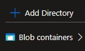

# Coding challenge
This project provides a local REST API built with FastAPI to access and read CSV files stored in Azure Blob Storage.

Features:

Retrieves data from CSV files in a specified Azure Blob Storage container.
Exposes an endpoint to fetch data by filename.
Returns the CSV data structure as JSON (headers and rows).
Requirements:

* Python 3.6 or later
* FastAPI
* Azure Storage SDK for Python (azure-storage-blob)
* Pydantic

Setup:

1. Storage the input .csv input files in your Azure Blob Storage.

* Search Storage accounts on Azure Portal and enter your storage account.

* Then go to Storage browser menu.

* Click on Blob container menu.

* Go to Add container option.

* Open your container and click on Add directory option.

* Go into your directory, click on Upload option to upload the .csv files.

2. Create the server in Azure SQL.

* Search Azure SQL on Azure Portal and click on Create option.

* Select SQL databases and Database server on Resource type to create the server.

* Complete the following fields of resource group, server name, location. Choose the authentication method, for example, the SQL authentication and set an adming login username and a password.

* Then continue with the next configuration (Networking, Security, etc.) or click on Review + create option to finish.

3. Create the database

* On Azure SQL, click on create again.

git
* Select SQL databases and Single database as Resource type and click on Create.

* Complete the basic fields.

* Then continue with the next configurations or click on Review + create to finish.

4. Install required libraries in your virtual environment:

    pip install fastapi azure-storage-blob pydantic uvicorn pyodbc

5. Replace placeholders in main.py:

* YOUR_AZURE_STORAGE_CONNECTION_STRING: Your Azure Storage connection string.
* YOUR_CONTAINER_NAME: The name of the container containing your CSV files.

Running the API:

1. Save the script as main.py.

2. Run the script from the command line:

    python main.py

This starts the FastAPI server on port 8000 by default.

Testing the API:

1. Open the FastAPI documentation in your browser:

    http://localhost:8000/docs

2. Explore the available endpoint (/csv/{filename}) and its usage.

3. Test retrieving specific CSV data by replacing {filename} with the actual file name in the URL (e.g., http://localhost:8000/csv/jobs.csv).
